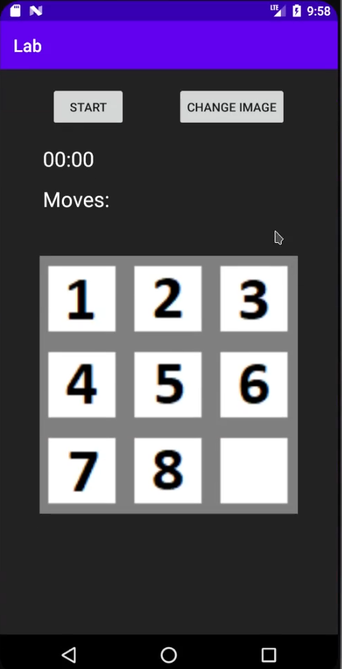
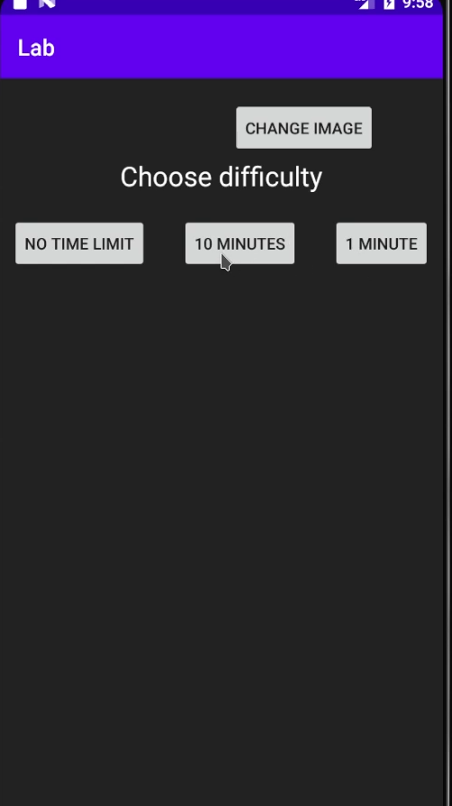
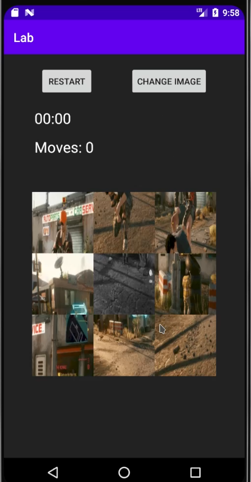
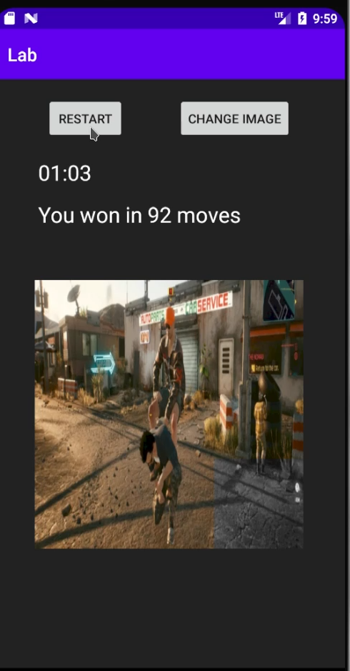
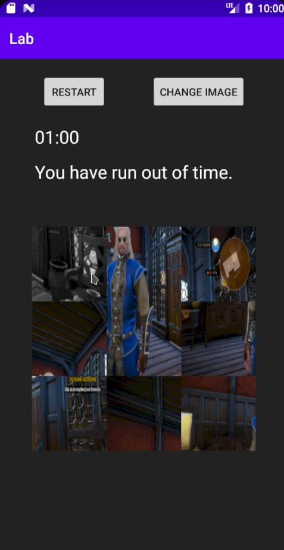

Created in 12.2020. This is a simple sliding puzzle game on android written in kotlin. There is a video showing how the game works in game.mp4.

### Start of a game

### Chossing time limit

### Shuffled image

### Winning the game

### Running out of time

